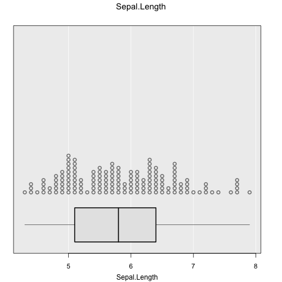

```{r, include = FALSE}
unlink("man/figures/*")
knitr::opts_chunk$set(
  collapse = TRUE,
  comment = "#>",
  fig.path = "man/figures/README-",
  out.width = "50%"
)
```

# iNZightPlots

Graphics functions which provide a simple, easy-to-learn interface, allowing beginners to explore and visualize data easily.


## Install

Easily install the latest release version from CRAN:
``` r
install.packages("iNZightRegression")
```

For the latest development version:
```{r, eval=FALSE}
# install.packages("devtools")
devtools::install_github("iNZightVIT/iNZightTools")
devtools::install_github("iNZightVIT/iNZightMR")
devtools::install_github("iNZightVIT/iNZightPlots")
```

## Usage

`iNZightPlots` provides a simple interface to graphics, which are most easily produced using the following function:
```{r test, load,eval=FALSE}
library(iNZightPlots)
inzplot(~Sepal.Length, data = iris)
```

```{r demo, echo=FALSE, results="hide"}
library(iNZightPlots)
t <- file.path("man", "figures", "README-demo-1.png")
png(t)
inzplot(~Sepal.Length, data = iris)
dev.off()
```
`r knitr::include_graphics(t)`

From there, formula notation can be used to explore relationships between variables:
```{r usage_notation, eval=FALSE}
inzplot(Sepal.Length ~ Species, data = iris)
inzplot(Sepal.Length ~ Sepal.Width, data = iris)
inzplot(Sepal.Length ~ Sepal.Width | Species, data = iris)
```

```{r demo_usage, echo=FALSE, results="hide"}
t <- file.path("man", "figures", "README-demo-usage-%d.png")
png(t)
inzplot(~Sepal.Length, data = iris)
inzplot(Sepal.Length ~ Sepal.Width, data = iris)
inzplot(Sepal.Length ~ Sepal.Width | Species, data = iris)
dev.off()
```



These functions all produce different graphs (dot plot and scatter plot), which means the focus is on exploring data, not on which type of graph to use. Subsetting works as expected, and can include up to two variables (e.g., `y ~ x | g1 + g2`).

There are additionally two companion functions for summary and inference information, which are
```{r usage_fns}
inzsummary(~Sepal.Length, data = iris)
inzinference(Sepal.Length ~ Species, data = iris)
```
These use the same notation as the plot, and are intended to be used alongside.


## Features

There are many, many features available in `iNZightPlots`, all of which are added simply through additional arguments to `inzplot()`. For a full list, check `?iNZightPlot` (this is the base function for which `inzplot()` is a convenience wrapper) and `?inzpar`.


### Colour and size

Probably the most common features to add to a graph, we have the `sizeby` and `colby` arguments which map an additional variable to size and colour, respectively:
```{r colours, fig.align = "center"}
inzplot(Sepal.Length ~ Sepal.Width, data = iris, colby = Species)
```

### Inference lines

Usually you want to know if what you see has any statistical significance, and `iNZightPlots` makes this easy. We also provide __comparison intervals__ which can be, very simply, interpreted as "overlapping comparison intervals indicate no significant difference between groups".
```{r inference, eval = FALSE}
# Add confidence intervals
inzplot(Sepal.Length ~ Species, data = iris,
  inference.type = c("conf", "comp"), # red and black, respectively
  inference.par = "mean"
)
```

```{r inference-demo, echo = FALSE, results="hide"}
t <- file.path("man", "figures", "README-demo-inf.png")
png(t)
inzplot(Sepal.Length ~ Species, data = iris,
  inference.type = c("conf", "comp"), # red and black, respectively
  inference.par = "mean"
)
dev.off()
```

`r knitr::include_graphics(t)`

For scatter plots, inference uses linear trends. You can add a bootstrap sample of trend estimates using the `bs.inference` argument:
```{r trends, fig.align = "center"}
inzplot(Sepal.Length ~ Sepal.Width, data = iris,
  trend = "linear",
  bs.inference = TRUE
)
```
