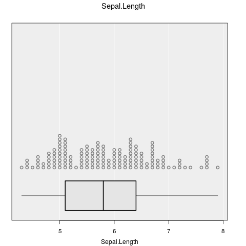
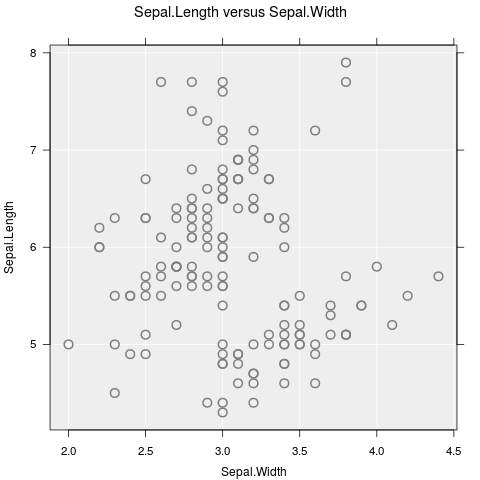
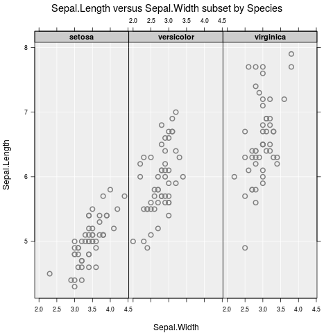
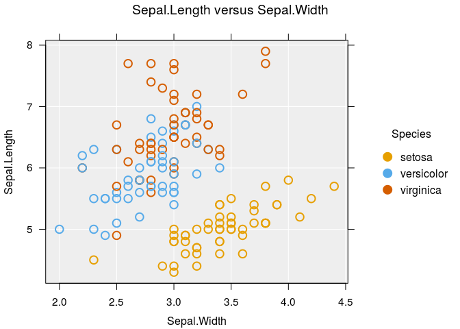
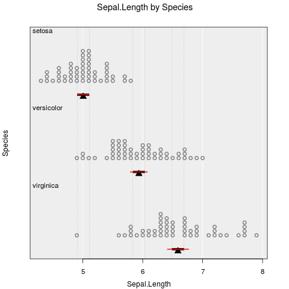
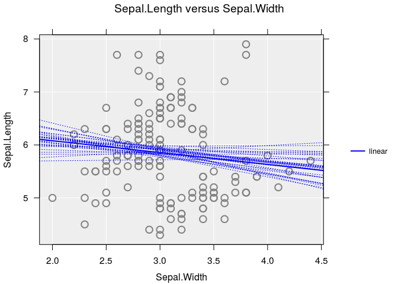

# iNZightPlots

Graphics functions which provide a simple, easy-to-learn interface, allowing beginners to explore and visualize data easily.

## Install

Easily install the latest release version from CRAN:

``` r
install.packages("iNZightRegression")
```

For the latest development version:

``` r
# install.packages("devtools")
devtools::install_github("iNZightVIT/iNZightTools")
devtools::install_github("iNZightVIT/iNZightMR")
devtools::install_github("iNZightVIT/iNZightPlots")
```

## Usage

`iNZightPlots` provides a simple interface to graphics, which are most easily produced using the following function:

``` r
library(iNZightPlots)
inzplot(~Sepal.Length, data = iris)
```



From there, formula notation can be used to explore relationships between variables:

``` r
inzplot(Sepal.Length ~ Species, data = iris)
inzplot(Sepal.Length ~ Sepal.Width, data = iris)
inzplot(Sepal.Length ~ Sepal.Width | Species, data = iris)
```

  

These functions all produce different graphs (dot plot and scatter plot), which means the focus is on exploring data, not on which type of graph to use. Subsetting works as expected, and can include up to two variables (e.g., `y ~ x | g1 + g2`).

There are additionally two companion functions for summary and inference information, which are

``` r
inzsummary(~Sepal.Length, data = iris)
#> ====================================================================================================
#>                                           iNZight Summary
#> ----------------------------------------------------------------------------------------------------
#>    Primary variable of interest: Sepal.Length (numeric)
#>                                  
#>    Total number of observations: 150
#> ====================================================================================================
#> 
#> Summary of Sepal.Length:
#> ------------------------
#> 
#> Estimates
#> 
#>    Min   25%   Median   75%   Max    Mean       SD   Sample Size
#>    4.3   5.1      5.8   6.4   7.9   5.843   0.8281           150
#> 
#> 
#> ====================================================================================================
inzinference(Sepal.Length ~ Species, data = iris)
#> ====================================================================================================
#>                                iNZight Inference using Normal Theory
#> ----------------------------------------------------------------------------------------------------
#>    Primary variable of interest: Sepal.Length (numeric)
#>              Secondary variable: Species (categorical)
#>                                  
#>    Total number of observations: 150
#> ====================================================================================================
#> 
#> Inference of Sepal.Length by Species:
#> -------------------------------------
#> 
#> Group Means with 95% Confidence Intervals
#> 
#>                 Lower   Estimate   Upper
#>        setosa   4.906      5.006   5.106
#>    versicolor   5.789      5.936   6.083
#>     virginica   6.407      6.588   6.769
#> 
#> One-way Analysis of Variance (ANOVA F-test)
#> 
#>    F = 119.26, df = 2 and 147, p-value < 2.22e-16
#> 
#>           Null Hypothesis: true group means are all equal
#>    Alternative Hypothesis: true group means are not all equal
#> 
#> 
#> ### Difference in mean Sepal.Length between Species groups
#>     (col group - row group)
#> 
#> Estimates
#> 
#>                 setosa   versicolor
#>    versicolor   -0.930             
#>     virginica   -1.582       -0.652
#> 
#> 95% Confidence Intervals (adjusted for multiple comparisons)
#> 
#>                  setosa   versicolor
#>    versicolor   -1.1738             
#>                 -0.6862             
#>     virginica   -1.8258      -0.8958
#>                 -1.3382      -0.4082
#> 
#> P-values
#> 
#>                 setosa   versicolor
#>    versicolor        0             
#>     virginica        0            0
#> 
#> 
#> ====================================================================================================
```

These use the same notation as the plot, and are intended to be used alongside.

## Features

There are many, many features available in `iNZightPlots`, all of which are added simply through additional arguments to `inzplot()`. For a full list, check `?iNZightPlot` (this is the base function for which `inzplot()` is a convenience wrapper) and `?inzpar`.

### Colour and size

Probably the most common features to add to a graph, we have the `sizeby` and `colby` arguments which map an additional variable to size and colour, respectively:

``` r
inzplot(Sepal.Length ~ Sepal.Width, data = iris, colby = Species)
```



### Inference lines

Usually you want to know if what you see has any statistical significance, and `iNZightPlots` makes this easy. We also provide **comparison intervals** which can be, very simply, interpreted as "overlapping comparison intervals indicate no significant difference between groups".

``` r
# Add confidence intervals
inzplot(Sepal.Length ~ Species, data = iris,
  inference.type = c("conf", "comp"), # red and black, respectively
  inference.par = "mean"
)
```



For scatter plots, inference uses linear trends. You can add a bootstrap sample of trend estimates using the `bs.inference` argument:

``` r
inzplot(Sepal.Length ~ Sepal.Width, data = iris,
  trend = "linear",
  bs.inference = TRUE
)
```


